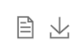

# Rhomis Dashboard Front-End
The back-end of this project is [GitHub Repository](https://github.com/Patanga/GroupK_CGIAR_Farm_Datasets_BackEnd).

# Getting Started with Front-End

This project was bootstrapped with [Create React App](https://github.com/facebook/create-react-app).

# Setup for Local Development

1. Download the back-end of this project and run it, for detail please visit this [GitHub Repository](https://github.com/Patanga/GroupK_CGIAR_Farm_Datasets_BackEnd).
2. Clone this  front -end repository
3. Install npm dependencies: `npm install`
4. Run the app : `npm start`
   - By default, it will run on localhost:8081. This is the default for projects created with [Create React App](https://github.com/facebook/create-react-app).
   - You can change the default port by overwriting the .env file:
     - `npm start` will use the `.env.development` file. You can overwrite this locally by copying the file to `.env.development.local`.
     - To update the port, add a new "PORT" variable.
     - For more information on how Create React App handles .env files, see the documentation [here](https://create-react-app.dev/docs/adding-custom-environment-variables/#adding-development-environment-variables-in-env)

# Web Page Function Reference

1. The switch bar on the top right can be clicked to switch pages, a total of 6 pages.

2. In the filter box on the left, you can select countries, regions, projects, and per capita income. The filtering is linked, and only the content of the corresponding range will appear under the influence of the content selected by the previous level.

3. Some dashboards have a zoom box on the right or below, use the mouse wheel or drag the start and end points to view the data within the range you need.

4. 

   Two buttons in the upper right corner of each dashboard. The function corresponding to the first button is to convert the chart into the form of data so that the original data can be read directly. The second button is the download function, which can download the chart in png format.

# Code Parts Reference

In the folder called `GroupK_CGIAR_Farm_Datasets_FrontEnd/src`,  there are five main parts which are calculators, components, css, pages and plotOptions. The followings are the instructions of each parts.

### calculators

It is divided into six files, corresponding to the pages selected by the top button. This part is called as a function in the pages file, and the data read from the back-end API selects the part needed by each dashboard according to the key value for further calculation. Calculations serve two purposes. The first is to perform statistical calculation on the data. The data output in the back-end API is JSON in units of each household (livelihood). The calculation module needs to process and count all households as a whole. The second is to serve the output of each chart part in the plotOption file, try to use a data format that meets the requirements of Echarts (such as two-dimensional arrays or specially placed key-value pairs, etc.)

### components

### css

### pages

### plotOptions

It is divided into six folders according to different pages. Each folder contains the configuration content required by Echarts of each dashboards, and will return a JSON file, which is the JSON required by the options of Echarts. These options will be standardized according to the type and readability of the chart, including but not limited to parameters such as color, font, grid position, and axis units. At the same time, the data will be further adjusted, such as sorting or capitalization, etc., and adjusted in the formatter. This  [Chart Configuration link](https://echarts.apache.org/en/option.html#title) is the configuration instructions for Echarts.
